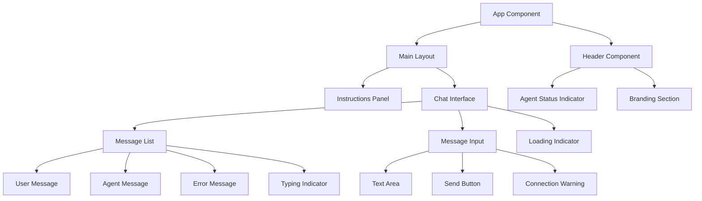
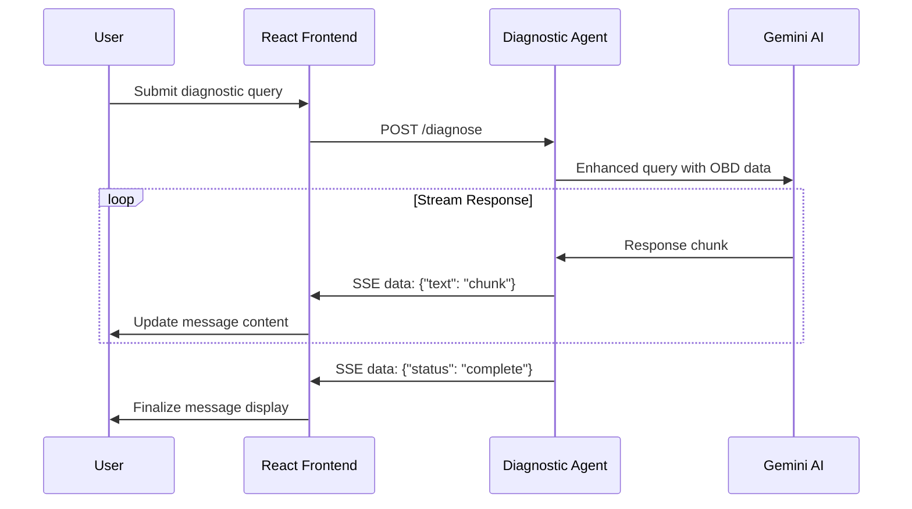
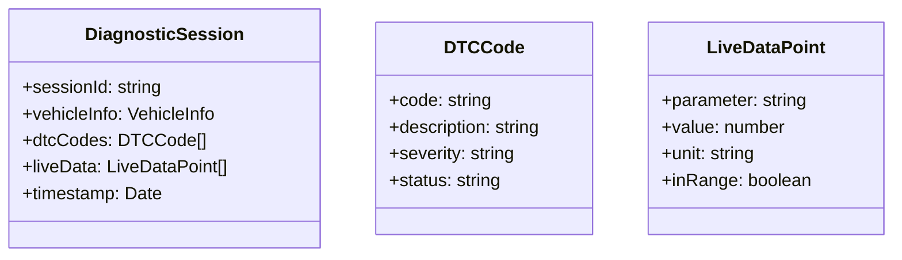
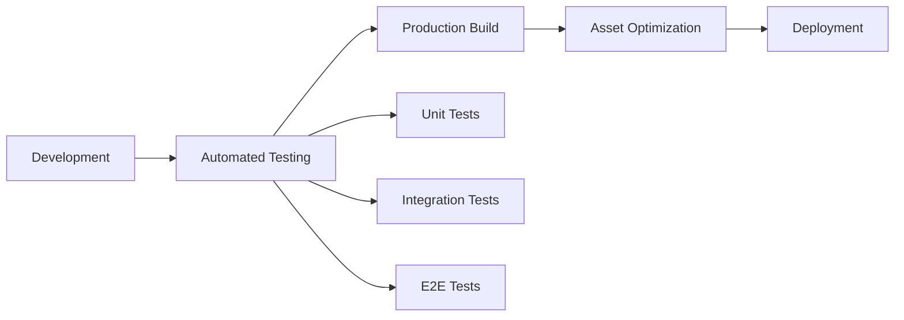

# GUI Implementation Design - AI Car Diagnostic System

## Overview

This document outlines the comprehensive design for implementing a production-ready web interface for the AI Car Diagnostic System. The current basic implementation serves as a foundation, but requires significant enhancements for scalability, user experience, and maintainability.

The system is a full-stack application integrating a React-based frontend with a Python backend agent that provides AI-powered car diagnostics through OBD-II integration and Google Gemini AI.

## Frontend Architecture

### Technology Stack & Dependencies

The frontend leverages modern web technologies optimized for performance and developer experience:

- **React 19**: Component-based UI framework with concurrent rendering features
- **TypeScript**: Static typing for enhanced code quality and developer tooling
- **Vite**: Fast build tool with hot module replacement and optimized production bundles
- **Tailwind CSS 4.1**: Utility-first CSS framework with custom automotive color palette
- **Lucide React**: Comprehensive SVG icon library with React components

### Component Architecture

#### Component Hierarchy



#### Component Specifications

**App Component**
- Root component managing global state and side effects
- Handles API communication with backend diagnostic agent
- Manages message history, loading states, and agent connectivity
- Implements auto-scrolling behavior for chat messages

**Header Component**
- Displays application branding with car icon and title
- Shows real-time agent status (online/offline) with visual indicators
- Responsive design adapting to mobile and desktop viewports

**Chat Interface**
- Real-time messaging interface for user-agent interaction
- Supports streaming responses through Server-Sent Events (SSE)
- Handles multiple message types: user, agent, and error messages
- Implements message timestamps and delivery status indicators

**Instructions Panel**
- Static educational content for user guidance
- Examples of diagnostic queries and OBD-II code formats
- Responsive layout collapsing to single column on mobile devices

### State Management

#### Core State Variables

```typescript
interface ApplicationState {
  messages: Message[]
  input: string
  isLoading: boolean
  agentStatus: AgentStatus | null
}

interface Message {
  id: string
  type: 'user' | 'agent' | 'error'
  content: string
  timestamp: Date
}

interface AgentStatus {
  available: boolean
  agent_url: string
  status_code?: number
  error?: string
}
```

#### State Management Patterns

- **Local State**: React hooks (`useState`, `useEffect`, `useRef`) for component-level state
- **Side Effects**: `useEffect` for agent status checking and auto-scrolling behavior
- **Optimistic Updates**: Immediate message display with subsequent error handling
- **Stream Processing**: Incremental content updates during SSE response streaming

### Styling Strategy

#### Tailwind CSS Configuration

The application uses a custom Tailwind configuration with automotive-specific design tokens:

```javascript
// Custom color palette
colors: {
  automotive: {
    50: '#f0f9ff',   // Light blue tints
    600: '#0284c7',  // Primary brand color
    700: '#0369a1'   // Hover states
  }
}
```

#### Component Utility Classes

- **Cards**: `.card` - White background with subtle shadows and rounded corners
- **Buttons**: `.btn-primary`, `.btn-secondary` - Consistent interactive elements
- **Inputs**: `.input-field` - Standardized form controls with focus states
- **Responsive Design**: Mobile-first approach with `lg:` breakpoint modifiers

### API Integration Layer

#### REST Endpoints Integration

**Agent Status Endpoint**
- **Method**: GET `/agent-status`
- **Purpose**: Health check for backend diagnostic agent
- **Polling**: On component mount and periodic health checks
- **Response**: Agent availability and connection details

**Diagnostic Query Endpoint**
- **Method**: POST `/diagnose`
- **Purpose**: Submit diagnostic queries to AI agent
- **Streaming**: Server-Sent Events for real-time response delivery
- **Error Handling**: Network failures, parsing errors, and agent unavailability

#### Error Handling Strategy

```typescript
// Comprehensive error handling for API communications
try {
  const response = await fetch('/diagnose', requestConfig)
  if (!response.ok) {
    throw new Error(`HTTP error! status: ${response.status}`)
  }
  // Process streaming response
} catch (error) {
  // Display user-friendly error messages
  // Log technical details for debugging
  // Provide recovery suggestions
}
```

## Backend Integration

### API Communication Patterns

#### Server-Sent Events (SSE) Implementation

The frontend processes streaming responses from the backend agent:



#### Data Flow Architecture

- **User Input**: Collected through textarea with validation
- **Query Enhancement**: Backend enriches queries with real-time OBD data
- **AI Processing**: Google Gemini AI generates diagnostic responses
- **Streaming Response**: Incremental content delivery via SSE
- **State Updates**: React state synchronization with incoming data

### OBD Integration Support

The frontend supports backend OBD-II integration capabilities:

- **Connection Status**: Visual indicators for OBD adapter connectivity
- **Real-time Data**: Display of live engine parameters and diagnostic trouble codes
- **Error Reporting**: User-friendly messages for OBD connection issues
- **Data Visualization**: Potential future enhancement for sensor data charts

## Enhanced Features Design

### Advanced Message Types

```typescript
interface EnhancedMessage extends Message {
  status?: 'sending' | 'delivered' | 'failed'
  metadata?: {
    obdConnected?: boolean
    dtcCodes?: string[]
    vehicleInfo?: VehicleInfo
  }
}
```

### Real-time Diagnostics Display



### Progressive Web App Features

- **Service Worker**: Offline capability for basic functionality
- **App Manifest**: Installation prompts for mobile devices
- **Push Notifications**: Diagnostic completion alerts
- **Local Storage**: Message history persistence

### Accessibility Enhancements

- **Screen Reader Support**: Proper ARIA labels and semantic HTML
- **Keyboard Navigation**: Tab order and keyboard shortcuts
- **High Contrast Mode**: Support for visual accessibility preferences
- **Focus Management**: Clear focus indicators and logical tab progression

## Testing Strategy

### Unit Testing Approach

```javascript
// Example test structure for React components
describe('ChatInterface Component', () => {
  test('renders message history correctly', () => {
    // Test message display and formatting
  })
  
  test('handles streaming responses', () => {
    // Mock SSE events and verify state updates
  })
  
  test('displays loading states appropriately', () => {
    // Verify loading indicators during API calls
  })
})
```

### Integration Testing

- **API Integration**: Mock backend responses for reliable testing
- **SSE Streaming**: Simulate streaming events and verify frontend handling
- **Error Scenarios**: Test network failures and invalid responses
- **Agent Status**: Verify connectivity indicators and error states

### End-to-End Testing

- **User Workflows**: Complete diagnostic session from start to finish
- **Cross-browser Compatibility**: Testing across modern browsers
- **Mobile Responsiveness**: Touch interactions and viewport adaptations
- **Performance Metrics**: Load times, rendering performance, memory usage

## Performance Optimization

### React Performance Patterns

- **Memoization**: `React.memo` for expensive component re-renders
- **Callback Optimization**: `useCallback` for stable function references
- **Effect Dependencies**: Proper dependency arrays for `useEffect`
- **Virtual Scrolling**: For large message histories

### Build Optimization

- **Code Splitting**: Dynamic imports for route-based splitting
- **Tree Shaking**: Elimination of unused library code
- **Asset Optimization**: Image compression and lazy loading
- **Bundle Analysis**: Webpack Bundle Analyzer for size monitoring

### Network Performance

- **HTTP/2**: Leverage multiplexing for concurrent requests
- **Compression**: Gzip/Brotli compression for static assets
- **CDN Integration**: Content delivery network for global performance
- **Caching Strategy**: Appropriate cache headers for static resources

## Security Considerations

### Frontend Security

- **Input Validation**: Client-side validation with server-side verification
- **XSS Prevention**: Proper content sanitization for user inputs
- **CSRF Protection**: Token-based protection for state-changing operations
- **Content Security Policy**: Strict CSP headers to prevent script injection

### API Security

- **Authentication**: Token-based authentication for API access
- **Rate Limiting**: Prevent abuse of diagnostic endpoints
- **Input Sanitization**: Server-side validation of all user inputs
- **Error Handling**: Avoid exposing sensitive information in error messages

## Deployment & DevOps

### Build Pipeline



### Environment Configuration

- **Development**: Hot reloading, source maps, debugging tools
- **Staging**: Production-like environment for final testing
- **Production**: Optimized builds, monitoring, error tracking

### Monitoring & Analytics

- **Error Tracking**: Sentry or similar for runtime error monitoring
- **Performance Monitoring**: Web Vitals and custom metrics
- **User Analytics**: Usage patterns and feature adoption
- **API Monitoring**: Response times and error rates