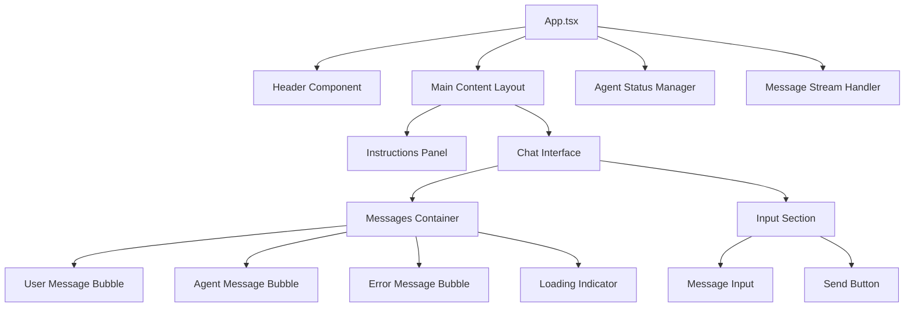
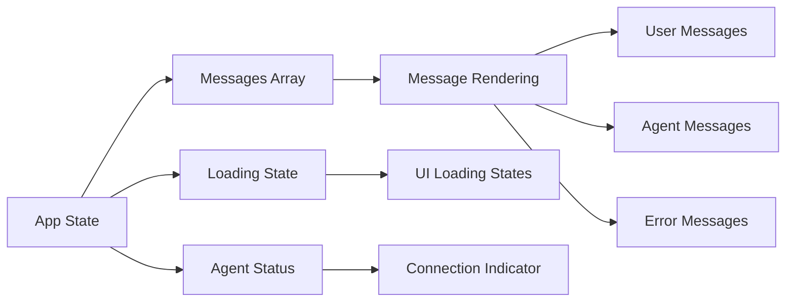
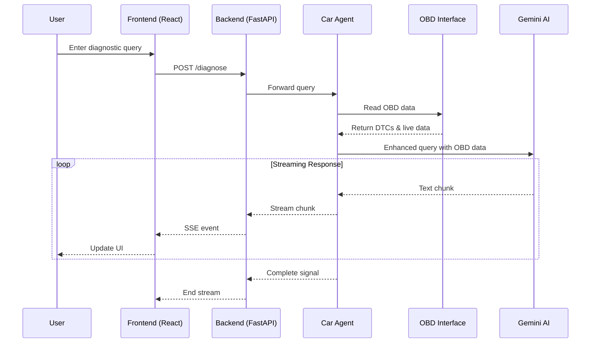

# GUI Implementation Design Document

## Overview

This document outlines the comprehensive implementation design for the AI Car Diagnostic web interface, a full-stack application that provides a conversational diagnostic experience between users and their vehicles through AI-powered analysis integrated with real-time OBD-II data.

The system consists of a React TypeScript frontend with real-time streaming capabilities and a Python FastAPI backend that bridges the user interface with the existing car diagnostic agent system.

## Technology Stack & Dependencies

### Frontend Stack
- **Framework**: React 19.1.1 with TypeScript
- **Build Tool**: Vite 7.1.2 for fast development and optimized production builds
- **Styling**: Tailwind CSS 4.1.12 for utility-first responsive design
- **Icons**: Lucide React for consistent iconography
- **Utilities**: clsx for conditional CSS class handling
- **Development Tools**: ESLint, PostCSS, Autoprefixer

### Backend Stack
- **Framework**: FastAPI for async HTTP server with automatic OpenAPI documentation
- **ASGI Server**: Uvicorn with standard extras for production deployment
- **File Handling**: aiofiles for async file operations
- **HTTP Client**: httpx for external API communication
- **Configuration**: python-dotenv for environment variable management
- **Multipart**: python-multipart for form data handling

### Integration Layer
- **Agent System**: car_diagnostic_agent with OBD-II integration
- **AI Engine**: Google Gemini 2.5 Pro via LangChain
- **Communication**: Server-Sent Events (SSE) for real-time streaming

## Component Architecture

### Frontend Component Structure



#### Core Component: App.tsx
**Location**: `/a2a_gui/frontend/src/App.tsx`

**State Management**:
- `messages`: Array of conversation messages with type safety
- `input`: Current user input string
- `isLoading`: Loading state for message processing
- `agentStatus`: Real-time agent availability status

**Key Features**:
- **Real-time Chat Interface**: Conversational UI with message bubbles
- **Streaming Response Handling**: Server-Sent Events integration for live AI responses
- **Agent Status Monitoring**: Live connection status with the diagnostic agent
- **Error Handling**: Graceful error display and recovery
- **Responsive Design**: Mobile-first layout with Tailwind CSS
- **Accessibility**: Keyboard navigation and screen reader support

#### Message Types Interface
```typescript
interface Message {
  id: string
  type: 'user' | 'agent' | 'error'
  content: string
  timestamp: Date
}

interface AgentStatus {
  available: boolean
  agent_url: string
  status_code?: number
  error?: string
}
```

### Component Hierarchy & Props Flow



### Styling Strategy

**Design System**:
- **Color Palette**: Automotive-themed blue (`automotive-600`) with semantic colors
- **Typography**: System font stack with responsive sizing
- **Layout**: CSS Grid and Flexbox for responsive layouts
- **Components**: Utility classes with custom component styles

**Key CSS Classes**:
```css
.card { @apply bg-white rounded-xl shadow-sm border border-gray-200; }
.btn-primary { @apply bg-automotive-600 hover:bg-automotive-700 text-white; }
.input-field { @apply border border-gray-300 rounded-lg px-3 py-2 focus:ring-2; }
```

### Routing & Navigation

The application uses a single-page design focused on the diagnostic conversation interface. Navigation is contextual within the chat interface:

- **Main Interface**: Chat-based diagnostic interaction
- **Status Indicators**: Real-time agent connectivity status
- **Error States**: Inline error handling and recovery prompts

## Backend Architecture

### Server Structure Design

```mermaid
graph TD
    FastAPI[FastAPI Server] --> StaticFiles[Static File Serving]
    FastAPI --> APIRoutes[API Routes]
    
    APIRoutes --> AgentStatus[/agent-status]
    APIRoutes --> DiagnoseEndpoint[/diagnose]
    
    DiagnoseEndpoint --> StreamingResponse[SSE Streaming]
    StreamingResponse --> AgentIntegration[Car Diagnostic Agent]
    
    AgentIntegration --> OBDInterface[OBD-II Interface]
    AgentIntegration --> GeminiAI[Google Gemini AI]
    
    StaticFiles --> ReactBuild[React Build Assets]
```

### Required Backend Implementation

**Main Server File**: `/a2a_gui/main.py`

**Core Components Needed**:

1. **FastAPI Application Setup**
   - CORS middleware for frontend communication
   - Static file serving for React build
   - Error handling middleware

2. **Agent Status Endpoint**
   ```python
   @app.get("/agent-status")
   async def get_agent_status():
       # Check car_diagnostic_agent availability
       # Return connection status and agent URL
   ```

3. **Diagnostic Streaming Endpoint**
   ```python
   @app.post("/diagnose")
   async def diagnose_stream(request: DiagnosticRequest):
       # Stream response from car diagnostic agent
       # Handle OBD integration and AI responses
       # Return Server-Sent Events
   ```

4. **Agent Integration Layer**
   - Connection management to `car_diagnostic_agent`
   - Message routing and response streaming
   - Error handling and fallback mechanisms

### API Endpoints Reference

#### GET /agent-status
**Purpose**: Check diagnostic agent availability

**Response Schema**:
```json
{
  "available": boolean,
  "agent_url": string,
  "status_code": number,
  "error": string
}
```

#### POST /diagnose
**Purpose**: Stream diagnostic responses from AI agent

**Request Schema**:
```json
{
  "message": string
}
```

**Response**: Server-Sent Events stream
```
data: {"text": "Hello, I am a 2015 Ford Focus..."}
data: {"text": " I can see you're experiencing..."}
data: {"status": "complete"}
```

**Authentication Requirements**: None (local application)

## Data Flow Architecture



### State Management Pattern

**Frontend State Flow**:
1. **Message Submission**: User input triggers API call
2. **Loading State**: UI shows loading indicator
3. **Stream Processing**: SSE events update message content incrementally
4. **Completion**: Stream ends, UI returns to ready state
5. **Error Handling**: Network or agent errors display inline

**Backend State Management**:
- **Stateless Design**: Each request is independent
- **Connection Pooling**: Reuse agent connections when possible
- **Error Recovery**: Graceful degradation when agent unavailable

## API Integration Layer

### Agent Communication Protocol

**Connection Management**:
```python
class CarAgentClient:
    async def check_status(self) -> AgentStatus
    async def stream_diagnosis(self, message: str) -> AsyncGenerator[str, None]
    async def handle_connection_error(self, error: Exception) -> None
```

**Error Handling Strategy**:
- **Agent Unavailable**: Display offline status, allow manual input
- **Streaming Interruption**: Retry mechanism with exponential backoff
- **Invalid Responses**: Sanitize and display error messages

### OBD Integration Handling

**Data Processing Flow**:
1. **OBD Status Check**: Verify adapter connection before diagnosis
2. **Real-time Data**: Include live engine parameters in responses
3. **DTC Processing**: Parse and enhance diagnostic trouble codes
4. **Fallback Mode**: Manual DTC input when OBD unavailable

## Testing Strategy

### Frontend Testing Approach

**Unit Testing** (Jest + React Testing Library):
```typescript
// Message rendering tests
test('renders user messages correctly', () => {
  render(<App />);
  // Test message bubble rendering
});

// SSE streaming tests
test('handles streaming responses', async () => {
  // Mock SSE events
  // Verify incremental updates
});
```

**Integration Testing**:
- **API Communication**: Mock backend responses
- **Error Scenarios**: Network failures, invalid data
- **Stream Handling**: SSE connection management

### Backend Testing Framework

**FastAPI Testing** (pytest + httpx):
```python
@pytest.mark.asyncio
async def test_agent_status_endpoint():
    # Test agent availability checking

@pytest.mark.asyncio  
async def test_diagnose_streaming():
    # Test SSE response streaming
```

**Mock Testing Strategy**:
- **Agent Responses**: Mock car diagnostic agent
- **OBD Data**: Simulated vehicle data
- **AI Responses**: Controlled LLM outputs

### End-to-End Testing

**User Journey Testing**:
1. **Connection Flow**: Agent status → successful connection
2. **Diagnostic Flow**: User query → streaming response → completion
3. **Error Scenarios**: Connection failures, invalid inputs
4. **OBD Integration**: Real-time data integration testing

## Implementation Requirements

### Development Environment Setup

**Frontend Development**:
```bash
cd a2a_gui/frontend
npm install
npm run dev  # Vite dev server on port 5173
```

**Backend Development**:
```bash
cd a2a_gui
python -m pip install -e .
python main.py  # FastAPI server on port 8000
```

### Production Build Process

**Frontend Build**:
```bash
npm run build  # Generates dist/ folder
```

**Backend Integration**:
- Serve React build from FastAPI static files
- Configure CORS for production domains
- Environment variable configuration

### File Structure Requirements

```
a2a_gui/
├── main.py                 # FastAPI server entry point
├── app/
│   ├── __init__.py
│   ├── server.py          # FastAPI application
│   ├── routes.py          # API endpoints
│   └── agent_client.py    # Car agent integration
├── frontend/              # React application (existing)
└── static/               # Built React assets (generated)
```

### Environment Configuration

**Required Environment Variables**:
```env
# Agent connection
CAR_AGENT_URL=http://localhost:8001
CAR_AGENT_TIMEOUT=30

# Server configuration  
HOST=0.0.0.0
PORT=8000
DEBUG=False

# CORS settings
ALLOWED_ORIGINS=["http://localhost:5173"]
```

### Deployment Considerations

**Production Deployment**:
- **Static Asset Serving**: Efficient React build serving
- **WebSocket Compatibility**: SSE connection stability
- **Load Balancing**: Multiple FastAPI instances if needed
- **Monitoring**: Health checks and error logging

**Security Measures**:
- **CORS Configuration**: Restrict allowed origins
- **Input Validation**: Sanitize user messages
- **Rate Limiting**: Prevent abuse of diagnostic endpoints
- **Error Sanitization**: Avoid exposing internal errors