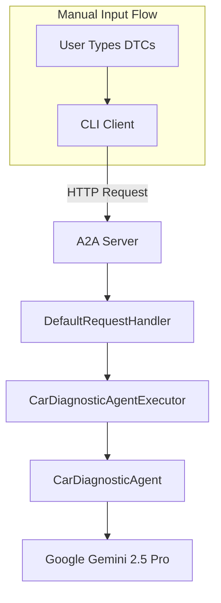
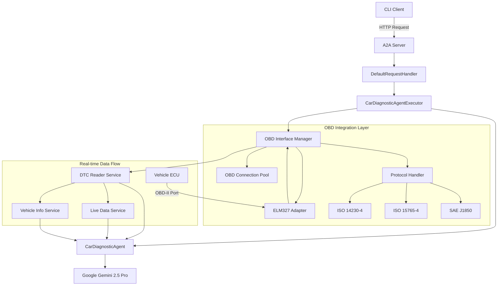

# Real OBD Integration Design

## Overview

This design document outlines the integration of real-time OBD-II (On-Board Diagnostics) capabilities into the existing Car Diagnostic Agent. Currently, the system requires manual input of Diagnostic Trouble Codes (DTCs), but this enhancement will enable direct communication with vehicle ECUs (Electronic Control Units) through OBD-II protocols.

The integration will transform the agent from a static diagnostic tool to a dynamic, real-time vehicle monitoring and diagnostic system while maintaining the existing A2A (Agent-to-Agent) architecture and persona-based AI responses.

## Architecture

### Current System Architecture



### Enhanced System Architecture with OBD Integration



## OBD Integration Components

### 1. OBD Interface Manager

The central component responsible for managing OBD-II connections and coordinating data retrieval.

**Responsibilities:**
- Establish and maintain OBD-II connections
- Manage connection lifecycle and error recovery
- Coordinate between different OBD services
- Handle protocol negotiation

**Key Methods:**
- `connect(port: str, baudrate: int) -> bool`
- `disconnect() -> bool`
- `is_connected() -> bool`
- `get_supported_protocols() -> List[str]`
- `set_protocol(protocol: str) -> bool`

### 2. Protocol Handler

Manages different OBD-II communication protocols and ensures compatibility across various vehicle makes and models.

**Supported Protocols:**
- ISO 14230-4 (Keyword Protocol 2000)
- ISO 15765-4 (CAN Bus)
- SAE J1850 PWM
- SAE J1850 VPW
- ISO 9141-2

### 3. DTC Reader Service

Specialized service for reading and interpreting Diagnostic Trouble Codes from the vehicle's ECU.

**Core Functions:**
- Read stored DTCs
- Read pending DTCs
- Clear DTCs (with user confirmation)
- Retrieve freeze frame data
- Get DTC descriptions

### 4. Live Data Service

Provides real-time monitoring of vehicle parameters and sensor data.

**Monitored Parameters:**
- Engine RPM
- Vehicle Speed
- Engine Coolant Temperature
- Intake Air Temperature
- Mass Air Flow Rate
- Throttle Position
- Fuel System Status
- Oxygen Sensor Readings

### 5. Vehicle Information Service

Retrieves static vehicle information for enhanced diagnostic accuracy.

**Retrieved Information:**
- Vehicle Identification Number (VIN)
- Calibration IDs
- CVN (Calibration Verification Numbers)
- ECU Information
- Supported PIDs (Parameter IDs)

## Data Models

### OBD Connection Configuration

```markdown
| Field | Type | Description |
|-------|------|-------------|
| port | string | Serial port identifier (e.g., "/dev/ttyUSB0", "COM3") |
| baudrate | integer | Communication speed (9600, 38400, 115200) |
| timeout | float | Connection timeout in seconds |
| protocol | string | OBD protocol identifier |
| auto_detect | boolean | Enable automatic protocol detection |
```

### DTC Information Model

```markdown
| Field | Type | Description |
|-------|------|-------------|
| code | string | DTC code (e.g., "P0171") |
| description | string | Human-readable description |
| severity | string | Error severity (Critical, Warning, Info) |
| status | string | Current status (Active, Pending, Stored) |
| freeze_frame | object | Associated freeze frame data |
| timestamp | datetime | When the code was detected |
```

### Live Data Reading Model

```markdown
| Field | Type | Description |
|-------|------|-------------|
| pid | string | Parameter ID |
| name | string | Parameter name |
| value | float | Current value |
| unit | string | Unit of measurement |
| min_value | float | Minimum expected value |
| max_value | float | Maximum expected value |
| timestamp | datetime | Reading timestamp |
```

### Vehicle Information Model

```markdown
| Field | Type | Description |
|-------|------|-------------|
| vin | string | Vehicle Identification Number |
| make | string | Vehicle manufacturer |
| model | string | Vehicle model |
| year | integer | Model year |
| engine_type | string | Engine specification |
| supported_pids | list | List of supported Parameter IDs |
| ecu_info | object | ECU identification data |
```

## Enhanced Agent Capabilities

### 1. Real-time Diagnostic Mode

The agent will support continuous monitoring mode where it can:
- Continuously read live data from the vehicle
- Monitor for new DTCs in real-time
- Provide proactive alerts for parameter anomalies
- Stream diagnostic updates to connected clients

### 2. Interactive Diagnostic Sessions

Enhanced interaction patterns:
- **Initial Connection**: "Let me connect to your vehicle and read the current status..."
- **Live Monitoring**: "I'm monitoring your engine parameters. Current RPM is 750, coolant temperature is 85°C..."
- **DTC Detection**: "I've detected a new trouble code P0301 - Engine Misfire Detected in Cylinder 1"

### 3. Historical Data Analysis

The agent will maintain diagnostic history:
- Track DTC patterns over time
- Correlate environmental conditions with issues
- Provide trend analysis and predictive maintenance suggestions

## Integration Patterns

### 1. Asynchronous OBD Operations

All OBD operations will be asynchronous to maintain system responsiveness:

```python
async def read_dtcs() -> List[DTCInfo]:
    # Non-blocking DTC reading
    pass

async def get_live_data(pids: List[str]) -> Dict[str, LiveDataReading]:
    # Non-blocking live data retrieval
    pass
```

### 2. Connection Management

Implement robust connection handling:
- Automatic reconnection on connection loss
- Connection pooling for multiple simultaneous requests
- Graceful degradation when OBD connection is unavailable

### 3. Error Handling and Fallback

Comprehensive error handling strategy:
- Fallback to manual input mode when OBD connection fails
- Detailed error reporting for connection issues
- Recovery mechanisms for protocol errors

## Security Considerations

### 1. Vehicle Access Control

- Implement authentication mechanisms for OBD access
- Logging of all OBD operations for audit purposes
- Rate limiting to prevent excessive ECU queries

### 2. Data Privacy

- Secure handling of VIN and vehicle-specific data
- Optional data anonymization for diagnostic sharing
- Compliance with automotive data protection standards

### 3. Safety Mechanisms

- Read-only operations by default
- Explicit user confirmation for any write operations (e.g., clearing DTCs)
- Prevention of operations that could affect vehicle safety systems

## Testing Strategy

### 1. Unit Testing

- Mock OBD interfaces for isolated component testing
- Protocol handler validation with test data sets
- Error condition simulation and recovery testing

### 2. Integration Testing

- Testing with OBD simulators
- Cross-platform compatibility testing
- Performance testing under various connection conditions

### 3. Hardware Testing

- Testing with actual ELM327 adapters
- Validation across different vehicle makes and models
- Real-world diagnostic scenario testing

## Hardware Requirements

### Supported OBD Adapters

| Adapter Type | Interface | Protocols Supported | Notes |
|--------------|-----------|-------------------|--------|
| ELM327 USB | USB Serial | All standard OBD-II | Recommended for desktop use |
| ELM327 Bluetooth | Bluetooth SPP | All standard OBD-II | Mobile and wireless applications |
| ELM327 WiFi | TCP/IP | All standard OBD-II | Network-based diagnostics |
| Professional Scanners | USB/Ethernet | Extended protocols | Enhanced diagnostic capabilities |

### System Requirements

- USB port (for USB adapters) or Bluetooth/WiFi capability
- Serial communication libraries
- Minimum 1GB RAM for data buffering
- Storage for diagnostic history and logs

## Migration Strategy

### Phase 1: Core OBD Integration
- Implement basic OBD connection and DTC reading
- Integrate with existing agent architecture
- Maintain backward compatibility with manual input

### Phase 2: Live Data Integration
- Add real-time parameter monitoring
- Enhance agent responses with live data context
- Implement streaming diagnostic updates

### Phase 3: Advanced Features
- Historical data analysis
- Predictive diagnostics
- Multi-vehicle support

### Phase 4: Optimization
- Performance optimization
- Enhanced error handling
- Extended protocol support