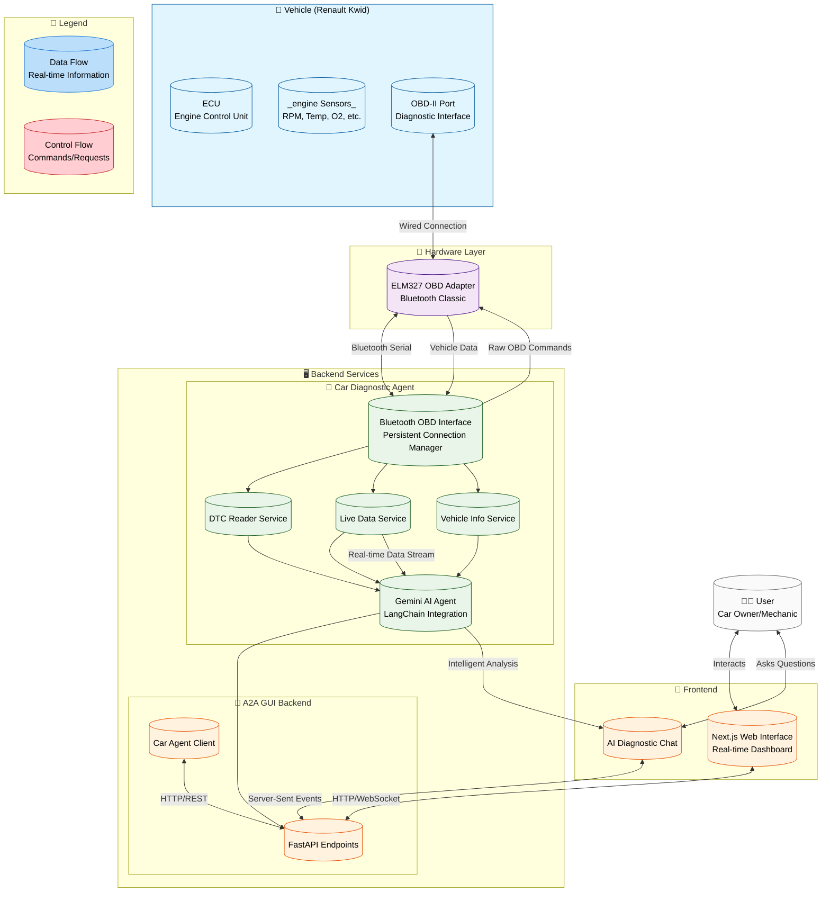

# Car Diagnostic and Repair Assistant

This project is an AI-powered car diagnostic and repair assistant. It combines a web-based graphical user interface with a powerful diagnostic agent that connects directly to your vehicle's OBD-II port. This allows you to read real-time data, diagnose issues, and receive intelligent, step-by-step repair guidance from an AI that acts as your personal car mechanic.

## System Architecture



### System Components Explained

#### 🚗 **Vehicle Layer**
- **ECU**: The car's main computer that controls engine operations
- **Sensors**: Various sensors monitoring engine parameters (RPM, temperature, oxygen levels, etc.)
- **OBD-II Port**: Standardized diagnostic interface for accessing vehicle data

#### 📡 **Hardware Layer**
- **ELM327 OBD Adapter**: Bluetooth-enabled device that translates between OBD-II protocol and serial communication

#### 🖥️ **Backend Services**

##### 🔧 **Car Diagnostic Agent**
- **Bluetooth OBD Interface**: Manages persistent Bluetooth connection to OBD adapter
- **DTC Reader Service**: Reads and interprets Diagnostic Trouble Codes
- **Live Data Service**: Monitors real-time engine parameters
- **Vehicle Info Service**: Retrieves vehicle identification and specifications
- **Gemini AI Agent**: Processes data and generates intelligent diagnostic insights

##### 🎨 **A2A GUI Backend**
- **FastAPI Endpoints**: REST API for frontend communication
- **Car Agent Client**: Proxy client for communicating with Car Diagnostic Agent

#### 📱 **Frontend**
- **Next.js Web Interface**: Modern web-based dashboard for vehicle diagnostics
- **AI Diagnostic Chat**: Interactive chat interface for asking diagnostic questions

#### 👨‍🔧 **User**
- **Car Owner/Mechanic**: End user interacting with the system

### Data Flow Process

1. **Vehicle Data Collection**: Sensors → ECU → OBD-II Port
2. **Hardware Translation**: OBD-II Protocol → Bluetooth Serial → OBD Adapter
3. **Backend Processing**: OBD Interface → Service Layers → AI Analysis
4. **Frontend Presentation**: API → Web Interface → User Dashboard
5. **Intelligent Interaction**: User Questions → AI Agent → Diagnostic Insights

This architecture enables real-time, intelligent vehicle diagnostics with an autonomous AI agent that continuously monitors and analyzes vehicle health.

## Features

### Real-time Diagnostics
- **Live Data Monitoring:** Connect to your vehicle's OBD-II port to monitor real-time parameters like engine RPM, coolant temperature, and more.
- **DTC Management:** Read and clear Diagnostic Trouble Codes (DTCs) directly from your vehicle's ECU.
- **Vehicle Information:** Automatically detect your vehicle's VIN, make, model, and year.
- **Broad Compatibility:** Supports all standard OBD-II protocols and works with a wide range of ELM327 adapters (USB, Bluetooth, WiFi).

### AI-Powered Analysis
- **Intelligent Diagnostics:** The AI agent analyzes real-time data and DTCs to provide expert-level diagnostic insights.
- **Persona-Based Responses:** The AI responds as if it *is* your specific vehicle, creating an intuitive and engaging user experience.
- **Step-by-Step Repair Guidance:** Receive clear, actionable steps to fix identified issues, from simple checks to more complex repairs.

### User-Friendly Interface
- **Web-Based Dashboard:** Access a modern, responsive web interface to view diagnostics and interact with the AI.
- **Interactive Chat:** Use natural language to ask questions and get answers about your vehicle's health.
- **Connection Management:** Easily manage your connection to the OBD-II adapter with real-time status monitoring.

## Getting Started

This guide will walk you through setting up and running the Car Diagnostic and Repair Assistant.

### Prerequisites

Before you begin, ensure you have the following installed:

- **Python:** 3.12 or higher
- **Node.js:** 18 or higher
- **uv:** The Python package manager. You can install it with `pip install uv`.
- **Google Gemini API Key:** You'll need this for the AI agent to function.
- **OBD-II Adapter (Optional):** An ELM327-compatible adapter (USB, Bluetooth, or WiFi) is required for real-time vehicle diagnostics. The system can also work with manually entered DTCs.

### Installation and Setup

1.  **Clone the repository:**
    ```bash
    git clone https://github.com/your-username/your-repository.git
    cd car-diagnostic-assistant
    ```

2.  **Set up the Car Diagnostic Agent:**
    -   Navigate to the agent's directory:
        ```bash
        cd car_diagnostic_agent
        ```
    -   Create a `.env` file and add your Google Gemini API key:
        ```bash
        echo "GOOGLE_API_KEY=your_api_key_here" > .env
        ```
    -   Install the Python dependencies:
        ```bash
        uv install
        ```
    -   For more detailed setup instructions, see the [Car Diagnostic Agent README](./car_diagnostic_agent/README.md).

3.  **Set up the A2A GUI:**
    -   Navigate to the GUI's directory from the root of the project:
        ```bash
        cd a2a_gui
        ```
    -   Install the Python dependencies for the backend:
        ```bash
        uv install
        ```
    -   Navigate to the frontend directory:
        ```bash
        cd frontend
        ```
    -   Install the Node.js dependencies:
        ```bash
        npm install
        ```
    -   For more detailed setup instructions, see the [A2A GUI README](./a2a_gui/README.md).

### Running the Application

To run the application, you need to start both the Car Diagnostic Agent and the A2A GUI.

1.  **Start the Car Diagnostic Agent:**
    -   In a new terminal, navigate to the `car_diagnostic_agent` directory and run:
        ```bash
        uv run python -m app
        ```
    -   The agent will start on `http://localhost:10011`.

2.  **Start the A2A GUI:**
    -   In another terminal, navigate to the `a2a_gui` directory and run:
        ```bash
        uvicorn main:app --reload
        ```
    -   The GUI backend will start on `http://localhost:8000`.

3.  **Access the Application:**
    -   Open your web browser and navigate to `http://localhost:8000`.

You should now be able to use the web interface to connect to your vehicle (if you have an adapter) and interact with the AI diagnostic assistant.

## Project Structure

The project is organized into the following main directories:

```
.
├── a2a_gui/                # The web-based graphical user interface
├── car_diagnostic_agent/   # The AI-powered diagnostic agent
└── diagrams/               # System architecture diagrams
```

-   **`a2a_gui/`**: Contains the frontend (Next.js) and backend (FastAPI) for the web application. This is the main entry point for users interacting with the system. For more details, see the [A2A GUI README](./a2a_gui/README.md).
-   **`car_diagnostic_agent/`**: Contains the core diagnostic logic, including the OBD-II integration, AI agent, and related services. This component runs as a separate service. For more details, see the [Car Diagnostic Agent README](./car_diagnostic_agent/README.md).
-   **`diagrams/`**: Contains the system architecture diagrams in Mermaid format.

## Usage

Once the application is running, you can use it as follows:

1.  **Connect to Your Vehicle:**
    -   Ensure your OBD-II adapter is connected to your vehicle and the ignition is on.
    -   In the web interface, click "Connect to Vehicle" to establish a connection.

2.  **Run Diagnostics:**
    -   Once connected, you can run a full diagnostic scan to check for trouble codes and view live data.

3.  **Chat with the AI Mechanic:**
    -   Use the chat interface to ask questions in natural language. For example:
        -   "What do my trouble codes mean?"
        -   "How do I fix the P0171 code?"
        -   "Is my engine running too hot?"

For more detailed usage instructions and examples, please see the [A2A GUI README](./a2a_gui/README.md#usage).

## Contributing

We welcome contributions to the Car Diagnostic and Repair Assistant! Whether you're fixing a bug, adding a new feature, or improving the documentation, your help is appreciated.

To get started, please follow these general steps:

1.  **Fork the repository.**
2.  **Create a new feature branch.**
3.  **Make your changes.**
4.  **Add tests for any new functionality.**
5.  **Ensure all tests pass.**
6.  **Submit a pull request.**

For more detailed development guidelines, please see the README files in the respective subdirectories:

-   [A2A GUI Contributing Guidelines](./a2a_gui/README.md#development-guidelines)
-   [Car Diagnostic Agent Contributing Guidelines](./car_diagnostic_agent/README.md#contributing)

## License

This project is licensed under the MIT License.
