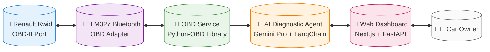
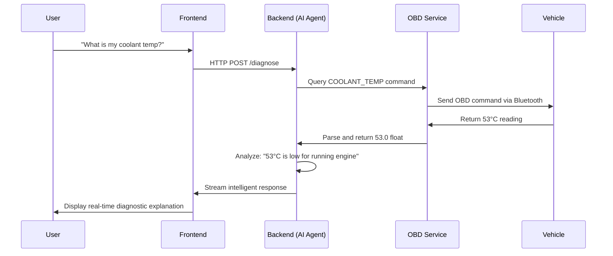

# Simple System Architecture

## Key Data Flow: User Question → Intelligent Response

## Key Components:

1. **🚗 Vehicle**: Renault Kwid with OBD-II port
2. **📡 Adapter**: ELM327 Bluetooth OBD-II adapter
3. **🔧 OBD Service**: Manages Bluetooth connection and OBD commands
4. **🤖 AI Agent**: Interprets data and generates intelligent responses
5. **📱 Dashboard**: Web interface for users
6. **👨‍🔧 User**: Car owner asking diagnostic questions

This system transforms raw OBD data into intelligent, conversational diagnostics!