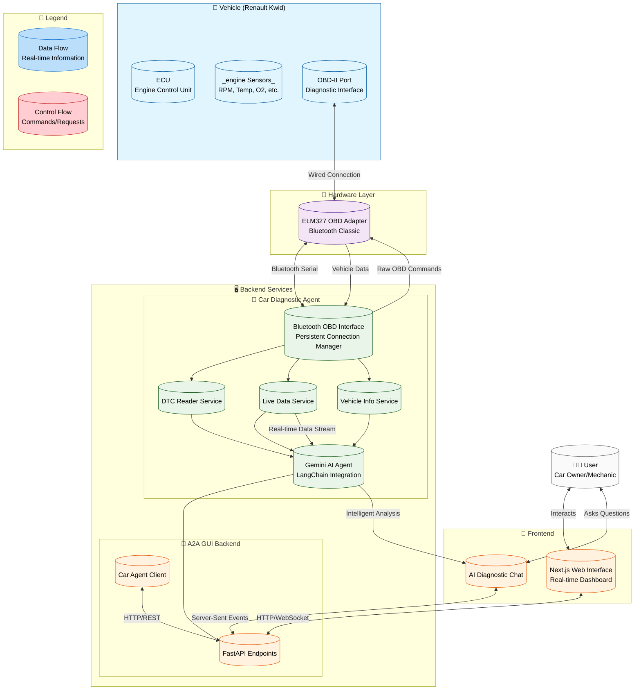

# System Architecture Diagram

## System Components Explained

### 🚗 **Vehicle Layer**
- **ECU**: The car's main computer that controls engine operations
- **Sensors**: Various sensors monitoring engine parameters (RPM, temperature, oxygen levels, etc.)
- **OBD-II Port**: Standardized diagnostic interface for accessing vehicle data

### 📡 **Hardware Layer** 
- **ELM327 OBD Adapter**: Bluetooth-enabled device that translates between OBD-II protocol and serial communication

### 🖥️ **Backend Services**

#### 🔧 **Car Diagnostic Agent**
- **Bluetooth OBD Interface**: Manages persistent Bluetooth connection to OBD adapter
- **DTC Reader Service**: Reads and interprets Diagnostic Trouble Codes
- **Live Data Service**: Monitors real-time engine parameters
- **Vehicle Info Service**: Retrieves vehicle identification and specifications
- **Gemini AI Agent**: Processes data and generates intelligent diagnostic insights

#### 🎨 **A2A GUI Backend**
- **FastAPI Endpoints**: REST API for frontend communication
- **Car Agent Client**: Proxy client for communicating with Car Diagnostic Agent

### 📱 **Frontend**
- **Next.js Web Interface**: Modern web-based dashboard for vehicle diagnostics
- **AI Diagnostic Chat**: Interactive chat interface for asking diagnostic questions

### 👨‍🔧 **User**
- **Car Owner/Mechanic**: End user interacting with the system

## Data Flow Process

1. **Vehicle Data Collection**: Sensors → ECU → OBD-II Port
2. **Hardware Translation**: OBD-II Protocol → Bluetooth Serial → OBD Adapter
3. **Backend Processing**: OBD Interface → Service Layers → AI Analysis
4. **Frontend Presentation**: API → Web Interface → User Dashboard
5. **Intelligent Interaction**: User Questions → AI Agent → Diagnostic Insights

This architecture enables real-time, intelligent vehicle diagnostics with an autonomous AI agent that continuously monitors and analyzes vehicle health.